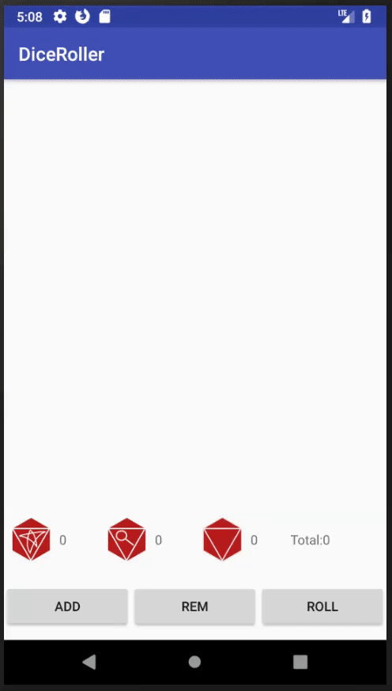
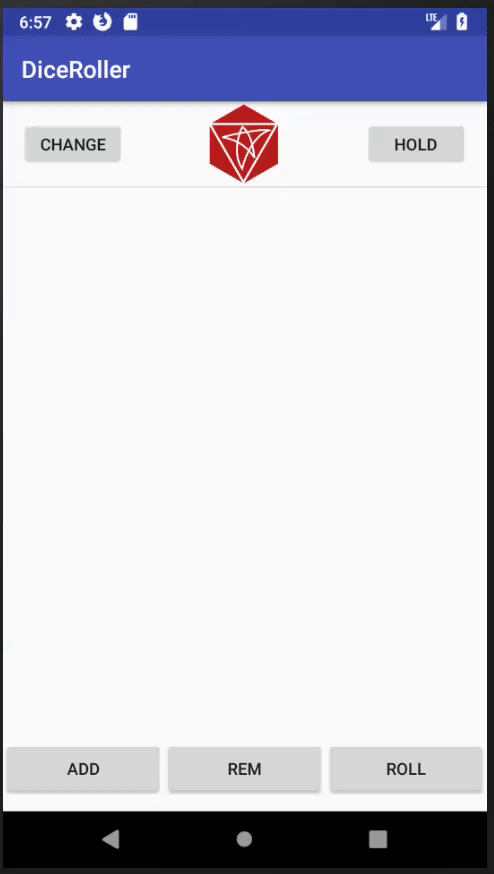
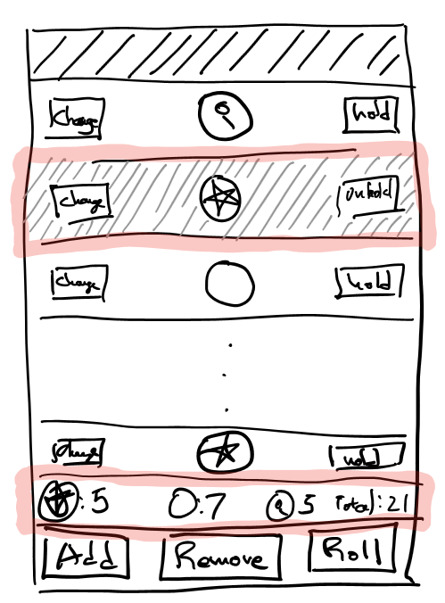
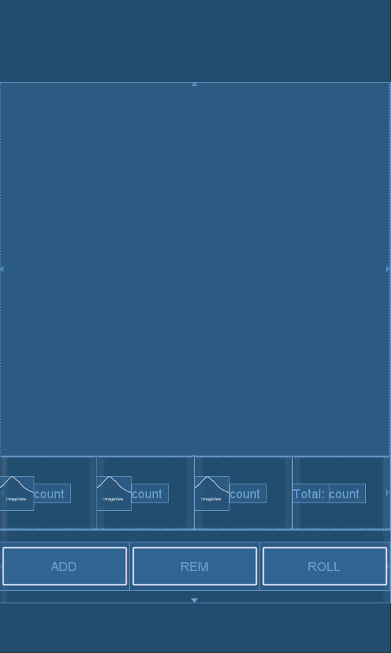

Android Tutorial - Dice Roller App for Mansions of Madness - Part 2 of 5
========================================================================
Improving on the basic Dice roller app designed in part 1 with visual cues and animation.

In this tutorial I'm building:
-----------------------------


Concepts Covered:
-----------------
* Analyzing Usability Shortfalls
* Button triggering Layout change and Animation

Reader Requirements
------------------------
* Beginner level Java
* Android: Basic Layout XML design ([covered in part1](https://github.com/sjan/Android-Tutorial-MansionOfMadnessDiceRoller-Part1#design))
* Android: ````ListView```` and ````Adapter```` concept ([covered in part1](https://github.com/sjan/Android-Tutorial-MansionOfMadnessDiceRoller-Part1#lists))

Table of Contents
--------
* [Proposal](#proposal)
    * Usability
    * Proposed Design
* [Re-organizing code](#refactor)
* [Dice summary layout](#dice_summary)
* [Populate Dice count](#dice_count)
* [Change row layout for Held Dice](#row_layout)
* [Animation: Spin Dice](#animation)

Discussion<a name="discussion"></a>
==========
Usability
---------
The [initial design proposed in part 1](https://github.com/sjan/Android-Tutorial-MansionOfMadnessDiceRoller-Part2) meets the basic requirements of a dice roller. But it's not user friendly at all!



### Shortfalls

1. For each roll, a user needs to scroll through the entire list and count dice. Counting physical dice is sorta fun. Counting rows in a scrolling list? not so much.
2. A user can't tell if a dice is set to 'hold'. Without any visual cue, it's really easy to lose track of which dice is held and unheld.
3. When a player triggers a roll, the dice face either changes or remains the same. This can be especially confusing when the user rolls repeat results.

Proposed Design
---------------
Tackling the issues outlined above, I propose:
1. Expanding the bottom area with a dice count section.
2. Tapping 'hold' changes the row background color and button text.
3. Tapping 'roll' triggers an animation. The animation will be a dice spin. Each dice will spin between 1 to 3 seconds and between 1 to 3 revolutions.



Implementation Steps
======================
1.  Organizing code.
2.  Dice summary Layout.
3.  Populate Dice count into the summary.
4.  Set row background grey and button text when Dice is in 'HELD' state.
5.  Trigger animation from roll button.

Step 1 : Refactor<a name="refactor"></a>
==================
In part 1, for simplicity's sake, I put all app logic in one class ````MainActivity.java````. As I add more features, I'm anticipating that the code will get pretty messy and difficult to read. As a first step to better organize my codebase, I split out the inner classes into top level classes ````Dice```` and ````DiceAdapter````.

    Dice.java

    public class Dice {
        public enum Face {
            BLANK,
            MAGNIFY,
            STAR
        }

        public static Random random = new Random();

        boolean hold = false;
        Face diceVal;

        Dice() {
            roll();
        }

        public void roll() {
            int num = random.nextInt(4);
            if(num == 0) { //25% magify
                this.diceVal = Face.MAGNIFY;
            } else {
                //37.5% star, 37.5% blank
                if(random.nextBoolean()) {
                    this.diceVal = Face.BLANK;
                } else {
                    this.diceVal = Face.STAR;
                }
            }
        }

        public void toggleHold() {
            hold = !hold;
        }

        public void nextValue() {
            int index = diceVal.ordinal();
            index = (index+1) % Face.values().length;
            diceVal = Face.values()[index];
        }
    }

    DiceAdapter.java

    public class DiceAdapter extends ArrayAdapter<Dice> {

        public DiceAdapter(@NonNull Context context, int resource, List<Dice> list) {
            super(context, resource, list);            
        }

        @Override
        public View getView(final int position, View convertView, ViewGroup parent) {
            if (convertView == null) {
                convertView = LayoutInflater.from(getContext()).inflate(R.layout.dice_row, parent, false);
            }

            //setup dice image
            ImageView imageView = convertView.findViewById(R.id.dice_icon);
            Dice dice = this.getItem(position);
            switch (dice.diceVal) {
                case BLANK:
                    imageView.setImageResource(R.drawable.blank_dice);
                    break;
                case MAGNIFY:
                    imageView.setImageResource(R.drawable.magnifying_glass);
                    break;
                case STAR:
                    imageView.setImageResource(R.drawable.star);
                    break;
            }

            //setup dice hold button
            Button holdButton = convertView.findViewById(R.id.dice_hold_button);
            holdButton.setOnClickListener(new View.OnClickListener() {
                @Override
                public void onClick(View v) {
                    Dice dice = getItem(position);
                    dice.toggleHold();
                    notifyDataSetChanged();
                }
            });

            //setup dice change button
            Button changeButton = convertView.findViewById(R.id.dice_change_button);
            changeButton.setOnClickListener(new View.OnClickListener() {
                @Override
                public void onClick(View v) {
                    Dice dice = getItem(position);
                    dice.nextValue();
                    notifyDataSetChanged();
                }
            });

            return convertView;
        }
    }

Step 2 : Dice Summary Layout <a name="dice_summary"></a>
=======================
The Dice summary sits between the dice roll area and button area. The layout consists of 4 columns. Each column includes dice count/label for the different categories blank/mag/star and total.



    activity_main.xml

    <?xml version="1.0" encoding="utf-8"?>
    <android.support.constraint.ConstraintLayout
        xmlns:android="http://schemas.android.com/apk/res/android"
        xmlns:app="http://schemas.android.com/apk/res-auto"
        xmlns:tools="http://schemas.android.com/tools"
        android:layout_width="match_parent"
        android:layout_height="match_parent"
        tools:context=".MainActivity">

        <ListView
            android:id="@+id/dice_list"
            android:layout_height="0dp"
            android:layout_width="match_parent"
            app:layout_constraintBottom_toTopOf="@id/dice_summary"
            app:layout_constraintLeft_toLeftOf="parent"
            app:layout_constraintRight_toRightOf="parent"
            app:layout_constraintTop_toTopOf="parent">
        </ListView>

        <LinearLayout
            android:id="@+id/dice_summary"
            android:layout_width="match_parent"
            android:layout_height="@dimen/control_bar_line_height"
            android:orientation="horizontal"
            android:weightSum="4"
            app:layout_constraintBottom_toTopOf="@id/button_bar"
            app:layout_constraintLeft_toLeftOf="parent"
            app:layout_constraintRight_toRightOf="parent"
            app:layout_constraintTop_toBottomOf="@id/dice_list">
            <LinearLayout
                android:layout_height="match_parent"
                android:layout_width="0dp"
                android:layout_weight="1"
                android:orientation="horizontal">
                <ImageView
                    android:layout_width="wrap_content"
                    android:layout_height="wrap_content"
                    android:padding="@dimen/dice_padding"
                    android:layout_gravity = "center"
                    android:src="@drawable/star"/>
                <TextView
                    android:id="@+id/star_count"
                    android:layout_gravity="center"
                    android:layout_height="wrap_content"
                    android:layout_width="wrap_content"
                    android:text="count"/>
            </LinearLayout>

            <LinearLayout
                android:layout_height="match_parent"
                android:layout_width="0dp"
                android:layout_weight="1"
                android:orientation="horizontal">
                <ImageView
                    android:layout_width="wrap_content"
                    android:layout_height="wrap_content"
                    android:layout_gravity="center"
                    android:padding="@dimen/dice_padding"
                    android:src="@drawable/magnifying_glass"/>
                <TextView
                    android:id="@+id/mag_count"
                    android:layout_gravity="center"
                    android:layout_height="wrap_content"
                    android:layout_width="wrap_content"
                    android:text="count"/>
            </LinearLayout>

            <LinearLayout
                android:layout_height="match_parent"
                android:layout_width="0dp"
                android:layout_weight="1"
                android:orientation="horizontal">
                <ImageView
                    android:layout_width="wrap_content"
                    android:layout_height="wrap_content"
                    android:layout_gravity = "center"
                    android:padding="@dimen/dice_padding"
                    android:src="@drawable/blank_dice"/>
                <TextView
                    android:id="@+id/blank_count"
                    android:layout_gravity="center"
                    android:layout_height="wrap_content"
                    android:layout_width="wrap_content"
                    android:text="count"/>
            </LinearLayout>

            <LinearLayout
                android:layout_width="0dp"
                android:layout_weight="1"
                android:layout_height="match_parent"
                android:orientation="horizontal">
                <TextView
                    android:layout_width="wrap_content"
                    android:layout_height="wrap_content"
                    android:layout_gravity="center"
                    android:text="@string/total_label"/>
                <TextView
                    android:id="@+id/total_count"
                    android:layout_gravity="center"
                    android:layout_height="wrap_content"
                    android:layout_width="wrap_content"
                    android:text="count"/>
            </LinearLayout>
        </LinearLayout>

        <LinearLayout
            android:id="@+id/button_bar"
            android:layout_weight="1"
            android:layout_width="match_parent"
            android:layout_height="@dimen/control_bar_line_height"
            android:orientation="horizontal"
            android:weightSum="3"
            app:layout_constraintBottom_toBottomOf="parent"
            app:layout_constraintLeft_toLeftOf="parent"
            app:layout_constraintRight_toRightOf="parent"
            app:layout_constraintTop_toBottomOf="@id/dice_summary">
            <Button
                android:id="@+id/add_dice_button"
                android:layout_gravity = "center"
                android:layout_weight="1"
                android:layout_width="wrap_content"
                android:layout_height="wrap_content"
                android:text="@string/add_button_label"
                android:onClick="addDice"/>
            <Button
                android:id="@+id/rem_dice_button"
                android:layout_gravity = "center"
                android:layout_weight="1"
                android:layout_width="wrap_content"
                android:layout_height="wrap_content"
                android:text="@string/rem_button_label"
                android:onClick="removeDice"/>
            <Button
                android:id="@+id/roll_dice_button"
                android:layout_weight="1"
                android:layout_gravity = "center"
                android:layout_width="wrap_content"
                android:layout_height="wrap_content"
                android:text="@string/roll_button_label"
                android:onClick="rollDice"/>
        </LinearLayout>
    </android.support.constraint.ConstraintLayout>

Step 3: Populate Dice Counts <a name="dice_count"></a>
==============================================

To populate the dice count, I add 2 methods to ````MainActivity.java```` to count dice and populate TextViews. ````updateDiceCount```` populates the values into the TextView and ````countDice```` counts the dice. The app will trigger this update on ````MainActivity.rollDice```` and ````changeButton.onClick````.

    MainActivity.java

    ....

    public void updateDiceCount() {
        TextView totalCount = findViewById(R.id.total_count);
        totalCount.setText(Integer.toString(diceList.size()));

        TextView blankCount = findViewById(R.id.blank_count);
        blankCount.setText(Integer.toString(countDice(BLANK)));

        TextView magCount = findViewById(R.id.mag_count);
        magCount.setText(Integer.toString(countDice(MAGNIFY)));

        TextView starCount = findViewById(R.id.star_count);
        starCount.setText(Integer.toString(countDice(STAR)));

    }

    private int countDice(Dice.Face type) {
        int count =0;
        for(Dice dice : diceList) {
           if(dice.diceVal == type) {
               count++;
           }
        }
        return count;
    }
    ....

Now that the ````DiceAdapter```` is in an outer class, we need a reference to the activity object from the adapter.

    public class DiceAdapter extends ArrayAdapter<Dice> {

        public DiceAdapter(@NonNull Context context, int resource, List<Dice> list) {
            super(context, resource, list);
            activity = (MainActivity) context;
        }
      ....
       //setup dice change button
       Button changeButton = convertView.findViewById(R.id.dice_change_button);
       changeButton.setOnClickListener(new View.OnClickListener() {
           @Override
           public void onClick(View v) {
               Dice dice = getItem(position);
               dice.nextValue();
               notifyDataSetChanged();
               ((MainActivity)getContext()).updateDiceCount();
           }
       });
    ....

## Why cast ````Context```` to ````MainActivity````? ##

The ````Context```` is amount the least self-explanatory concepts in Android. It's so broad that it's meaningless. Regardless, ````Context```` is an important concept so I'll breifly describe the idea. In Android world, applications can be started in different ways. Starting an application as an ````Activity```` is only one way. ````Context```` potentially describes different environments that initialize the code. In this case, the root context is ````MainActivity````. Other possible contexts are ````Application````, ````Activity````, ````Service```` and ````IntentService````. For details on this check out the [documentation](https://developer.android.com/reference/android/content/Context.html). Browsing discussions on this topic on Stackoverflow is highly recommended. For complex applications, casting context into Activity can be problematic because the context might **not** be an Activity. But for this app, I'll just make this *dangerous* assumption.

Step 4: Hold Button Triggers Background Change<a name="row_layout"></a>
==============================================

Currently, the hold button only triggers a state change in the dice object. For this feature, I modify the ````DiceAdapter```` ````getView```` logic. The new logic sets the row background color and button text depending on the ````Dice.hold```` state.

        DiceAdapter.java

        ....
        @Override
        public View getView(final int position, View convertView, ViewGroup parent) {

           ....
           //change background button text depending on hold state
           if(dice.hold) {
               convertView.setBackgroundColor(Color.LTGRAY);
               holdButton.setText(getContext().getResources().getString(R.string.hold_button_unhold_label));
           } else {
               convertView.setBackgroundColor(Color.WHITE);
               holdButton.setText(getContext().getResources().getString(R.string.hold_button_hold_label));
           }
           ....
        }

Step 5: Dice Spin <a name="animation"></a>
=================
The current 'Roll' button logic goes through all the dice, check the gold state, and sets new values for each. For every dice that rolls, trigger an animation for that dice image. To add dice animation, we get the corresponding ImageView and apply a [````RotationAnimation````](https://developer.android.com/reference/android/view/animation/RotateAnimation.html).

    MainActivity.java
    ....
    public void rollDice(View view) {
        //roll all dice that are not being held
        ListView listView = findViewById(R.id.dice_list);

        for(int i=0;i<diceList.size();i++) {
            Dice dice = diceList.get(i);

            if(!dice.hold) {
                dice.roll();
                View diceRowView = listView.getChildAt(i);                
                ImageView diceView = diceRowView.findViewById(R.id.dice_icon);
                int rotation = randomRotation();
                int duration = randomDuration();

                RotateAnimation rotate = new RotateAnimation(
                        0, rotation,
                        Animation.RELATIVE_TO_SELF, CENTER,
                        Animation.RELATIVE_TO_SELF, CENTER
                );
                rotate.setDuration(duration);
                rotate.setFillAfter(true);
                rotate.setFillEnabled(true);
                rotate.setInterpolator(new DecelerateInterpolator());

                diceView.startAnimation(rotate);            
            }
        }

        //notify adapter to update view
        diceAdapter.notifyDataSetChanged();
        updateDiceCount();
    }

    private int randomDuration() {
        return ONE_SECOND + random.nextInt(TWO_SECONDS);
    }

    private int randomRotation() {
        return FULL_REVOLUTION + random.nextInt(THREE_REVOLUTION);
    }
    ....

## Why random Duration and Rotation?

Without randomizing, the dice will spin in unison, which looks a bit odd. Adding a small offset to each makes the spin a bit more realistic.
